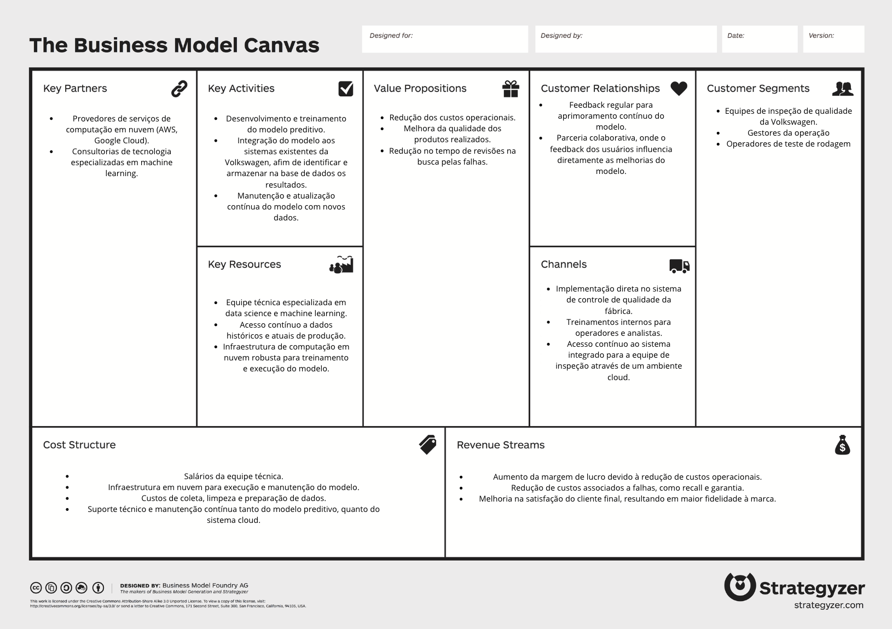

# Business Model Canvas

## **1.1** Introdução

Este Business Model Canvas foi desenvolvido para orientar o planejamento estratégico do projeto de modelo preditivo da Volkswagen, focado na otimização das inspeções de qualidade durante os testes de rodagem de veículos. O modelo preditivo visa melhorar a eficiência operacional, reduzir custos e aumentar a qualidade dos produtos. Abaixo, exploramos cada um dos blocos do Business Model Canvas, destacando os principais elementos que sustentam o sucesso desse projeto.

## **2.1** Key Partners (Principais Parceiros)

Os principais parceiros do projeto incluem:

- **Provedores de serviços de computação em nuvem:** Plataformas como AWS e Google Cloud fornecem a infraestrutura necessária para o armazenamento e processamento de dados em grande escala, essenciais para o funcionamento eficiente do modelo preditivo.
- **Consultorias de tecnologia especializadas em machine learning:** Parceiros técnicos que oferecem suporte na implementação e otimização do modelo preditivo, garantindo que as melhores práticas sejam seguidas.

**Explicação:** Esses parceiros são essenciais para fornecer a infraestrutura e o suporte técnico necessário para o sucesso do projeto. A colaboração com especialistas em machine learning e provedores de nuvem garante que o projeto seja desenvolvido com a mais alta qualidade e escalabilidade.

## **3.1** Key Activities (Atividades Principais)

As atividades principais do projeto incluem:

- **Desenvolvimento e treinamento do modelo preditivo:** Criação do modelo de machine learning baseado em dados históricos e sua calibração para garantir alta precisão.
- **Integração do modelo aos sistemas existentes da Volkswagen:** O modelo deve ser integrado aos sistemas de controle de qualidade da Volkswagen para que seus resultados possam ser aplicados diretamente nos processos de inspeção.
- **Manutenção e atualização contínua do modelo:** À medida que novos dados são coletados, o modelo deve ser reavaliado e ajustado para manter sua eficácia.

:::tip Nota
Essas atividades são essenciais para garantir que o modelo preditivo não só seja implementado com sucesso, mas também permaneça eficaz ao longo do tempo.
:::

**Explicação:** O desenvolvimento e a integração do modelo são críticos para sua operação. A manutenção contínua garante que o modelo evolua junto com as necessidades operacionais da Volkswagen, permanecendo relevante e eficaz.

## **4.1** Key Resources (Recursos Principais)

Os principais recursos necessários para o projeto incluem:

- **Equipe técnica especializada em data science e machine learning:** Profissionais qualificados são necessários para desenvolver, treinar e manter o modelo preditivo.
- **Acesso contínuo a dados históricos e atuais de produção:** Dados de qualidade são essenciais para o treinamento e ajuste do modelo.
- **Infraestrutura de computação em nuvem robusta:** Para processar grandes volumes de dados e executar o modelo em tempo real, uma infraestrutura em nuvem confiável é necessária.

:::important Importante!
Os recursos-chave garantem a capacidade técnica e operacional necessária para desenvolver e manter o modelo preditivo, o que é crucial para o sucesso do projeto.
:::

**Explicação:** A qualidade dos recursos humanos, dados e infraestrutura tecnológica são determinantes para o sucesso do modelo preditivo. Esses recursos suportam o ciclo completo de vida do projeto, desde a concepção até a operação contínua.

## **5.1** Value Propositions (Proposta de Valor)

As propostas de valor deste projeto incluem:

- **Redução dos custos operacionais:** O modelo ajuda a otimizar os processos de inspeção, reduzindo o tempo e o custo envolvidos.
- **Melhora da qualidade dos produtos realizados:** Com inspeções mais precisas, a qualidade dos veículos aumenta, o que se traduz em maior satisfação do cliente.
- **Redução no tempo e revisões na busca pelas falhas:** Identificar e corrigir falhas de maneira mais rápida e eficiente, evitando problemas maiores e garantindo a integridade dos veículos.

:::tip
A proposta de valor centraliza-se em fornecer uma solução que otimize a eficiência operacional e eleve os padrões de qualidade, resultando em **benefícios tangíveis** para a Volkswagen.
:::

**Explicação:** A proposta de valor reflete os principais benefícios que o modelo preditivo traz para a Volkswagen, tanto em termos de eficiência quanto de qualidade. Esses são os principais argumentos que justificam o investimento no projeto.

## **6.1** Customer Relationships (Relacionamento com Clientes)

As relações com os clientes serão geridas da seguinte forma:

- **Feedback regular para aprimoramento contínuo do modelo:** A coleta contínua de feedback das equipes de inspeção permite ajustes e melhorias no modelo, garantindo que ele continue a atender às necessidades da operação.
- **Parceria colaborativa:** O projeto promove um relacionamento de parceria, onde o feedback dos usuários finais influencia diretamente as melhorias e ajustes do modelo.

**Explicação:** O relacionamento com os clientes internos (equipes de inspeção e gestores) é vital para o sucesso do projeto. O feedback regular garante que o modelo permaneça alinhado com as necessidades do usuário final, enquanto a parceria colaborativa promove um ambiente de melhoria contínua.

## **7.1** Channels (Canais)

Os canais utilizados para entregar a solução incluem:

- **Implementação direta no sistema de controle de qualidade da fábrica:** O modelo será integrado diretamente ao sistema de controle de qualidade, permitindo a aplicação prática e imediata dos resultados.
- **Treinamentos internos para operadores e analistas:** A capacitação das equipes é crucial para garantir que todos saibam como utilizar o modelo e interpretar seus resultados.
- **Acesso contínuo ao sistema integrado através de um ambiente cloud:** As equipes terão acesso contínuo e remoto ao modelo e seus resultados, garantindo flexibilidade e disponibilidade.

**Explicação:** Esses canais são os meios pelos quais a solução será entregue e utilizada pelos clientes internos. A integração direta e os treinamentos asseguram que o modelo seja efetivamente implementado e utilizado na rotina da fábrica.

## **8.1** Customer Segments (Segmentos de Clientes)

Os principais segmentos de clientes são:

- **Equipes de inspeção de qualidade da Volkswagen:** Principais usuários do modelo, que utilizarão os resultados para otimizar as inspeções.
- **Gestores da operação:** Responsáveis por garantir que os processos de produção sejam eficientes e de alta qualidade.
- **Operadores de teste de rodagem:** Profissionais que realizam os testes de rodagem e se beneficiam de uma análise mais precisa do que deve ser inspecionado.

**Explicação:** Esses segmentos representam os principais grupos dentro da Volkswagen que se beneficiarão diretamente da implementação do modelo preditivo. Entender as necessidades de cada grupo é essencial para garantir que a solução atenda a todos de forma eficaz.

## **9.1** Cost Structure (Estrutura de Custos)

Os principais custos associados ao projeto incluem:

- **Salários da equipe técnica:** O custo contínuo para manter uma equipe de alta qualificação que possa desenvolver e manter o modelo.
- **Infraestrutura em nuvem para execução e manutenção do modelo:** Custos relacionados ao uso de serviços em nuvem, essenciais para o processamento de dados e execução do modelo.
- **Custos de coleta, limpeza e preparação de dados:** Garantir que os dados usados pelo modelo sejam de alta qualidade requer investimento em processos de coleta e preparação.
- **Suporte técnico e manutenção contínua:** Custos associados à manutenção tanto do modelo preditivo quanto do sistema cloud.

:::tip Nota
A estrutura de custos foca nos elementos essenciais para manter o projeto operante e sustentável a longo prazo, **garantindo** a **continuidade** dos benefícios propostos.
:::

**Explicação:** Esses custos são necessários para garantir a operação contínua e o sucesso do projeto. A estrutura de custos deve ser gerenciada cuidadosamente para maximizar o retorno sobre o investimento.

## **10.1** Revenue Streams (Fontes de Receita)

As fontes de receita ou benefícios financeiros incluem:

- **Aumento da margem de lucro devido à redução de custos operacionais:** A eficiência gerada pelo modelo preditivo se traduz diretamente em aumento de lucro.
- **Redução de custos associados a falhas, como recall e garantia:** Ao prever e prevenir falhas antes que elas ocorram, os custos relacionados a recalls e garantias são reduzidos.
- **Melhoria na satisfação do cliente final, resultando em maior fidelidade à marca:** Produtos de maior qualidade levam a clientes mais satisfeitos, que são mais propensos a permanecer fiéis à marca.

:::tip Nota
As fontes de receita destacam como a implementação do modelo preditivo contribui diretamente para os resultados financeiros da Volkswagen, **fortalecendo** a posição competitiva da empresa.
:::

**Explicação:** As fontes de receita demonstram o valor financeiro que o projeto traz para a Volkswagen. Esses benefícios reforçam a justificativa para o investimento no desenvolvimento e implementação do modelo preditivo.

## **11.1** Conclusão

Este Business Model Canvas oferece uma visão abrangente do projeto de modelo preditivo da Volkswagen, detalhando os elementos-chave que sustentam sua viabilidade e sucesso. Através de parcerias estratégicas, recursos especializados, e uma proposta de valor clara, o projeto visa transformar os processos de inspeção de veículos, resultando em maior eficiência, qualidade e satisfação do cliente. O alinhamento entre os segmentos de clientes, canais e atividades-chave garante que a solução desenvolvida atenda às necessidades da Volkswagen e contribua diretamente para seus objetivos estratégicos.

O sucesso deste projeto não apenas melhorará as operações internas da Volkswagen, mas também posicionará a empresa como líder em inovação no setor automotivo, pronta para enfrentar os desafios futuros com tecnologias de ponta e práticas operacionais otimizadas.
