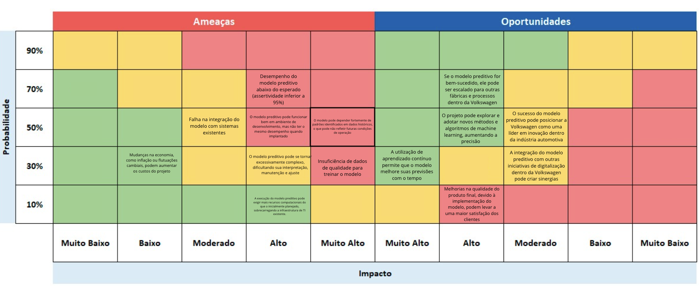

# Matriz de Riscos e Oportunidades

## **1.1** Introdução

Este documento oferece uma análise da Matriz de Riscos e Oportunidades relacionada ao desenvolvimento e implementação de um modelo preditivo na Volkswagen. A matriz categoriza possíveis riscos e oportunidades com base na probabilidade de ocorrência e no impacto sobre o projeto. Ao avaliar sistematicamente esses fatores, a matriz serve como uma ferramenta estratégica para orientar a tomada de decisões e garantir a execução bem-sucedida do projeto.

## **2.1** Riscos

Os seguintes riscos foram identificados para o projeto do modelo preditivo, cada um posicionado na matriz de acordo com sua probabilidade e impacto:

### **2.2** Riscos de Alta Probabilidade e Alto Impacto
- **Desempenho do modelo preditivo abaixo do esperado (assertividade inferior a 95%)**
  - **Explicação:** Esse risco reflete a possibilidade de que o modelo preditivo não atinja o nível de precisão desejado, levando a previsões pouco confiáveis. Isso pode impactar severamente o sucesso do projeto, pois o desempenho do modelo é crucial para melhorar os processos de inspeção.
  - **Mitigação:** Implementar testes e validações iterativas durante o desenvolvimento, permitindo a melhoria contínua da precisão do modelo.

### **2.3** Riscos de Probabilidade Moderada e Alto Impacto
- **Insuficiência de dados de qualidade para treinar o modelo**
  - **Explicação:** Dados de alta qualidade são essenciais para treinar o modelo de forma eficaz. Se os dados utilizados forem incompletos, inconsistentes ou não representativos, as previsões do modelo poderão ser falhas.
  - **Mitigação:** Implementar um processo rigoroso de limpeza e validação de dados e considerar a coleta de dados adicionais, se necessário.

- **Falha na integração do modelo com sistemas existentes**
  - **Explicação:** Problemas de integração podem surgir se o modelo preditivo for incompatível com os sistemas existentes na Volkswagen, levando a atrasos ou falhas na sua implantação.
  - **Mitigação:** Realizar testes de integração no início do projeto para identificar e resolver possíveis problemas.

- **O modelo pode depender fortemente de padrões identificados em dados históricos, o que pode não refletir futuras condições de operação**
  - **Explicação:** O modelo pode se adaptar excessivamente aos padrões dos dados históricos, que podem não se manter em cenários operacionais futuros, reduzindo seu poder preditivo.
  - **Mitigação:** Incorporar técnicas como validação cruzada e atualização do modelo com novos dados ao longo do tempo.

### **2.4** Riscos de Probabilidade Moderada e Impacto Moderado
- **O modelo preditivo pode funcionar bem em ambiente de desenvolvimento, mas não ter o mesmo desempenho quando implantado**
  - **Explicação:** Há o risco de que o modelo funcione bem durante o desenvolvimento, mas enfrente desafios ao ser implantado no ambiente de produção real.
  - **Mitigação:** Simular ambientes de produção durante as fases de teste para antecipar e resolver possíveis problemas de implantação.

- **O modelo preditivo pode se tornar excessivamente complexo, dificultando sua interpretação, manutenção e ajuste**
  - **Explicação:** Aumento da complexidade do modelo pode torná-lo difícil de entender, manter e ajustar, levando a uma usabilidade e flexibilidade reduzidas.
  - **Mitigação:** Buscar simplicidade no design do modelo, equilibrando complexidade com interpretabilidade e facilidade de manutenção.

### **2.5** Riscos de Baixa Probabilidade e Alto Impacto
- **Mudanças na economia, como inflação ou flutuações cambiais, podem aumentar os custos do projeto**
  - **Explicação:** Flutuações econômicas, como inflação ou variações na taxa de câmbio, podem aumentar os custos do projeto, afetando o orçamento e a viabilidade geral do projeto.
  - **Mitigação:** Implementar estratégias de gestão de risco financeiro, incluindo hedge contra riscos cambiais e inclusão de contingências de custos no orçamento do projeto.

### **2.6** Riscos de Baixa Probabilidade e Impacto Moderado
- **A execução do modelo preditivo pode exigir mais recursos computacionais do que o inicialmente planejado, sobrecarregando a infraestrutura de TI existente**
  - **Explicação:** Os recursos computacionais necessários para a execução do modelo preditivo podem exceder as estimativas iniciais, sobrecarregando a infraestrutura de TI da Volkswagen.
  - **Mitigação:** Realizar testes de carga e garantir que a infraestrutura de TI possa ser escalada para atender a possíveis aumentos na demanda.

## **3.1** Oportunidades

As seguintes oportunidades foram identificadas para o projeto do modelo preditivo, cada uma posicionada na matriz de acordo com sua probabilidade e impacto:

### **3.2** Oportunidades de Probabilidade Moderada e Impacto Muito Alto
- **Se o modelo preditivo for bem-sucedido, ele pode ser escalado para outras fábricas e processos dentro da Volkswagen**
  - **Explicação:** Uma implementação bem-sucedida do modelo preditivo em uma unidade pode levar à sua expansão para outras fábricas da Volkswagen, amplificando seus benefícios.
  - **Ação:** Desenvolver o modelo com a escalabilidade em mente, garantindo que ele possa ser facilmente adaptado a diferentes ambientes.

- **O projeto pode explorar e adotar novos métodos e algoritmos de machine learning, aumentando a precisão**
  - **Explicação:** O projeto oferece a oportunidade de integrar algoritmos de machine learning de ponta, potencialmente melhorando a precisão preditiva do modelo.
  - **Ação:** Manter-se atualizado com os avanços em machine learning e experimentar técnicas inovadoras para aprimorar o desempenho do modelo.

- **O sucesso do modelo preditivo pode posicionar a Volkswagen como uma líder em inovação dentro da indústria automotiva**
  - **Explicação:** A implementação bem-sucedida deste modelo preditivo pode reforçar a reputação da Volkswagen como uma empresa inovadora na indústria automotiva, aumentando o TRL da mesma e logo, melhorando sua imagem de mercado.
  - **Ação:** Destacar o sucesso do projeto em vias de comunicações externas afim de fortalecer a imagem da Volkswagen como líder em tecnologia.

### **3.3** Oportunidades de Probabilidade Moderada e Alto Impacto
- **A integração do modelo preditivo com outras iniciativas de digitalização dentro da Volkswagen pode criar sinergias**
  - **Explicação:** Integrar o modelo preditivo com outras iniciativas de digitalização na Volkswagen pode criar sinergias, resultando em maior eficiência e inovação.
  - **Ação:** Coordenar com outros projetos de digitalização dentro da Volkswagen para explorar possíveis oportunidades de integração.

- **A utilização de aprendizado contínuo permite que o modelo melhore suas previsões com o tempo**
  - **Explicação:** Ao aproveitar o aprendizado contínuo, o modelo pode melhorar suas capacidades preditivas ao longo do tempo, adaptando-se a novos dados e condições em mudança.
  - **Ação:** Implementar uma estrutura de aprendizado contínuo para garantir que o modelo evolua junto com o ambiente de produção.

### **3.4** Oportunidades de Baixa Probabilidade e Alto Impacto
- **Melhorias na qualidade do produto final, devido à implementação do modelo, podem levar a uma maior satisfação dos clientes**
  - **Explicação:** Se o modelo preditivo melhorar a qualidade do produto, pode levar a uma maior satisfação e fidelidade dos clientes, traduzindo-se em benefícios de longo prazo para o negócio.
  - **Ação:** Monitorar o impacto do modelo na qualidade do produto e no feedback dos clientes, ajustando as estratégias para maximizar essa oportunidade.

## **4.1** Conclusão

A Matriz de Riscos e Oportunidades para o projeto de modelo preditivo da Volkswagen oferece uma visão abrangente dos possíveis desafios e vantagens associados ao projeto. Ao identificar e analisar esses riscos e oportunidades, a Volkswagen pode navegar estrategicamente no projeto para maximizar os benefícios e mitigar possíveis problemas.

**Recomendações Estratégicas:**
- **Foco em riscos e oportunidades de alto impacto e alta probabilidade:** Esses elementos devem receber atenção prioritária, pois são os mais propensos a influenciar o sucesso do projeto.
- **Aproveitar oportunidades para crescimento a longo prazo:** Capitalizando nas oportunidades de alto impacto, a Volkswagen pode aprimorar sua vantagem competitiva e se posicionar como líder em inovação automotiva.
- **Monitoramento Contínuo:** Recomenda-se atualizações regulares na matriz para refletir quaisquer mudanças na probabilidade ou impacto dos riscos à medida que o projeto avança.

Esta matriz deve ser usada como uma ferramenta dinâmica, continuamente atualizada e referenciada ao longo do ciclo de vida do projeto de modelo preditivo para guiar a tomada de decisões e garantir o alinhamento com os objetivos estratégicos da Volkswagen.