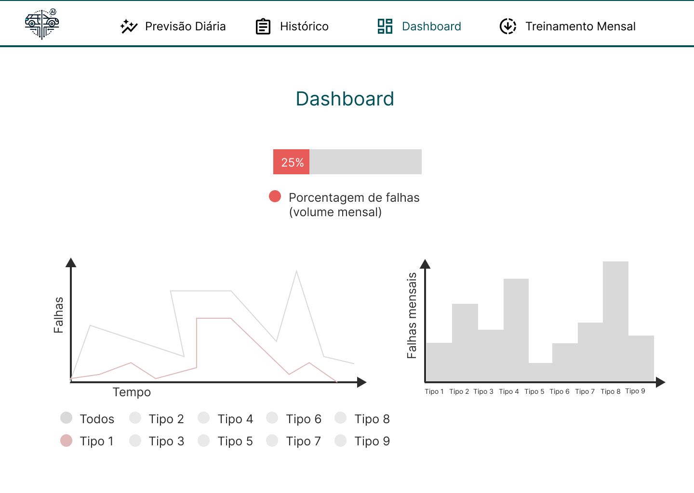

# Aplicação web

Uma aplicação web é um tipo de software que é acessado e executado através de um navegador, utilizando a internet como meio de comunicação entre o usuário e o servidor. Ao contrário de programas tradicionais que necessitam de instalação no dispositivo do usuário, as aplicações web operam em um ambiente distribuído, onde os dados e a lógica de aplicação são armazenados em servidores remotos. Isso permite que os usuários acessem e utilizem a aplicação de qualquer lugar, desde que possuam uma conexão à internet e um navegador compatível.

Essas aplicações são construídas utilizando tecnologias como HTML, CSS e JavaScript no lado do cliente, enquanto no lado do servidor podem utilizar diversas linguagens de programação e frameworks, como Python com Django, JavaScript com Node.js, ou PHP. A comunicação entre o cliente e o servidor geralmente é feita através de protocolos HTTP ou HTTPS, e os dados são frequentemente transmitidos em formatos como JSON ou XML. Além disso, as aplicações web modernas podem interagir com bancos de dados, APIs, e outros serviços para oferecer funcionalidades dinâmicas e personalizadas aos usuários.

Em resumo, uma aplicação web é uma solução tecnológica flexível e escalável, que permite a criação de interfaces interativas e acessíveis para uma vasta gama de usuários. Devido à sua natureza centralizada, as atualizações e manutenções são simplificadas, uma vez que as alterações no código ou na estrutura da aplicação precisam ser feitas apenas no servidor. Isso, combinado com a facilidade de acesso e a crescente popularidade de dispositivos conectados à internet, faz das aplicações web uma escolha ideal para uma ampla variedade de projetos.

## **1.1.** Tecnologias utilizadas

Para garantir a responsividade e interatividade da aplicação web, foram utilizadas diversas tecnologias que contribuíram para a criação de uma interface moderna e eficiente. Abaixo estão as principais tecnologias empregadas:

- **Nuxt**: O Nuxt.js é um framework de código aberto baseado em Vue.js que facilita a criação de aplicações web modernas e escaláveis. Ele fornece uma arquitetura de aplicação pré-configurada, que inclui funcionalidades como roteamento, renderização do lado do servidor, e gerenciamento de estado. Além disso, o Nuxt.js oferece uma série de plugins e módulos que permitem a integração com outras tecnologias e serviços, como APIs RESTful, GraphQL, e CMSs.

- **Vue**: O Vue.js é uma biblioteca JavaScript de código aberto para a construção de interfaces de usuário reativas e dinâmicas. Ele fornece uma sintaxe simples e intuitiva para a criação de componentes reutilizáveis, que podem ser combinados para formar interfaces complexas e interativas.

:::tip Informação
O Vue.js oferece um sistema de reatividade eficiente, que atualiza **automaticamente** a interface do usuário sempre que os dados subjacentes são modificados.
:::

- **Tailwind**: O Tailwind CSS é um framework de design de componentes CSS que oferece uma abordagem de estilo utilitário para a criação de interfaces de usuário. Em vez de fornecer classes CSS pré-definidas para estilizar elementos, o Tailwind permite que os desenvolvedores criem estilos personalizados usando classes utilitárias, que podem ser combinadas e reutilizadas para estilizar qualquer elemento HTML.

- **ShadCN**: O ShadCN é uma biblioteca de componentes pré-produzidos para o Vue.js, que oferece uma série de componentes reutilizáveis e personalizáveis para a criação de interfaces de usuário.

:::info 
O ShadCN inclui componentes para botões, formulários, modais, e muito mais, que podem ser **facilmente integrados** em qualquer aplicação Vue.js, bastando apenas instalar o ShadCN dentro de seu package-lock, para saber mais a respeito do mesmo clique [aqui](https://www.shadcn-vue.com/).
:::

## **2.1.** Modelagem da interface

Ao modelar a interface da aplicação, o foco principal foi garantir a iteratividade contínua do usuário e maximizar o valor agregado pela plataforma. A ideia central foi criar uma interface intuitiva e fácil de usar, com elementos visuais claros e bem organizados que facilitam a navegação e melhoram a experiência do usuário. Consideramos a necessidade de um design que permita a identificação rápida e eficiente de informações críticas, especialmente no contexto de detecção de falhas em veículos antes dos testes de rodagem.

Nossa abordagem priorizou a simplicidade, mas sem comprometer a funcionalidade. Buscamos desenvolver uma interface que facilite a usabilidade, organizando os elementos visuais de forma clara e acessível. Dessa forma, os técnicos e engenheiros da Volkswagen poderão utilizar o sistema sem a necessidade de treinamento extensivo, o que é crucial para garantir a eficiência operacional.

Além disso, nos concentramos em criar uma experiência de usuário que não só atenda às necessidades imediatas, mas que também seja escalável e adaptável a futuras atualizações. A interface foi desenhada para se integrar facilmente com outras tecnologias e sistemas, garantindo que o processo de inovação continue à medida que surgirem novas demandas e possibilidades tecnológicas.

### **2.1.1.** Design intuitivo

A interação intuitiva e contínua do usuário com a plataforma foi essencial durante o processo de modelagem da interface. Nosso objetivo foi criar uma interface que simplificasse a identificação rápida e eficiente de informações críticas, como a detecção de falhas nos veículos antes dos testes de rodagem. Cada elemento visual foi estrategicamente posicionado para melhorar a navegabilidade e a compreensão do usuário.

Priorizamos desenvolver um design que facilitasse a usabilidade, organizando os elementos visuais de forma clara e acessível. Dessa maneira, os técnicos e engenheiros da Volkswagen poderão utilizar o sistema sem a necessidade de treinamento extensivo, garantindo que a interface seja fácil de entender e operar. O design intuitivo também reduz o risco de erros operacionais, aumentando a segurança e a confiabilidade do sistema.

Por fim, o foco no design intuitivo é parte de uma estratégia maior para melhorar a eficiência operacional e a satisfação do usuário. A interface foi projetada para ser flexível e adaptável, permitindo futuras melhorias e atualizações sem a necessidade de mudanças drásticas na estrutura básica do sistema. Isso assegura a longevidade e a relevância contínua da plataforma.

### **2.1.2.** Eficiência e responsividade

A interface foi projetada com base em princípios de usabilidade para otimizar a eficiência das interações e minimizar erros potenciais. Incorporamos um design responsivo que assegura a fluidez da aplicação tanto em desktops quanto em dispositivos móveis. A responsividade é essencial para garantir que a aplicação atenda às necessidades dos usuários em diversos ambientes de trabalho, desde escritórios até operações de campo.

Além disso, a interface foi desenvolvida para se adaptar a diferentes tamanhos de tela e resoluções, garantindo uma experiência consistente e agradável para todos os usuários, independentemente do dispositivo que estiverem utilizando. Essa flexibilidade é crucial para assegurar que o sistema seja acessível e funcional em qualquer contexto, aumentando a versatilidade e a usabilidade da aplicação.

Por fim, a eficiência da interface não se limita à sua aparência. O design também leva em consideração a performance do sistema, garantindo tempos de resposta rápidos e uma experiência de usuário fluida. A combinação de eficiência e responsividade faz com que a plataforma seja não apenas prática, mas também eficaz na realização de suas funções.

### **2.1.3.** Integração com a I.A. para Detecção de Falhas

Considerando que o projeto envolve a utilização de Inteligência Artificial para identificar falhas nos veículos antes dos testes de rodagem, cada aspecto da interface foi cuidadosamente projetado para complementar essa funcionalidade. O sistema foi desenvolvido para fornecer dados relevantes e insights de forma rápida e precisa, facilitando a tomada de decisões e permitindo a detecção precoce de problemas. A integração com a I.A. é um dos pilares fundamentais deste projeto, e a interface foi criada para maximizar os benefícios dessa tecnologia.

Elementos como gráficos e painéis interativos foram dispostos estrategicamente para destacar de forma visualmente atraente as falhas identificadas pela I.A., facilitando a interpretação e a ação imediata por parte dos usuários. Esses elementos visuais não apenas informam, mas também orientam o usuário na identificação de problemas críticos, tornando a interface uma ferramenta indispensável para a tomada de decisões rápidas e informadas.

O resultado final é uma interface que não apenas atende às necessidades dos usuários, mas também se alinha com os objetivos da Volkswagen de garantir a qualidade e a segurança dos veículos antes de entrarem em fase de testes. A interface não é apenas um meio de interação, mas uma extensão das capacidades da I.A., permitindo que os usuários explorem todo o potencial da tecnologia para alcançar resultados superiores.

## **3.1** Protótipo de alta fidelidade ( Figma )

Para a criação do protótipo de alta fidelidade, utilizamos a ferramenta Figma, uma plataforma de design colaborativo baseada na nuvem. O Figma permite a criação de interfaces de usuário interativas e responsivas, que podem ser compartilhadas e visualizadas por toda a equipe de desenvolvimento.

Abaixo apresentamos o protótipo de alta fidelidade da aplicação web, que inclui as principais telas e elementos da interface, como a página inicial, o painel de controle, e os gráficos de falhas detectadas.

### **3.2** Landing Page

A Landing Page foi projetada para fornecer ao usuário acesso direto aos principais botões da aplicação: `Previsão Diária`, `Histórico`, `Dashboard` e `Treinamento Mensal`.

Esta página assume que o usuário do sistema já possui familiaridade com a operação completa, portanto, não são fornecidas explicações detalhadas sobre cada botão.

:::danger
Está pagina leva em conta que o usuário do sistema já possui certa familiarização com a operação completa, logo não fornecendo explicações sobre cada botão.
:::

Na hora de realizar a Landing Page, foi pensado em um design simples e intuitivo, com botões de fácil acesso e com cores amigáveis ao dia-a-dia, afim de não cansarem a vista.

### **3.3** Previsão Diária

Seguindo pelos botões, a tela de Previsão Diária foi pensada para ser a mais simples e direta possível, com um campo de texto para inserir o número do chassi do veículo e um botão para realizar a previsão, onde após isto iria fornecer ao usuário a previsão de falhas do veículo, que será abordada mais a frente.

#### **3.3.1** Resultado da Previsão

Após a previsão, será aberto para o usuário um modal com o resultado da previsão, onde será informado se o veículo possui falhas ou não, e caso possua, quais são as falhas detectadas. Segue abaixo primeiramente o modal de sucesso, onde não foi detectado nenhuma falha.

:::info
Dependendo de dados novos fornecidos pelo cliente este modal pode sofrer alterações até o fim do projeto.
:::

#### **3.3.2** Resultado da Previsão com Falhas

Agora, caso o veículo possua falhas, o modal irá informar ao usuário quais são as falhas detectadas, para que o mesmo possa tomar as devidas providências.

### **3.4** Histórico

A tela de Histórico foi projetada para fornecer ao usuário um registro de todas as previsões realizadas, incluindo a data e hora de cada previsão, o número do chassi do veículo, e o resultado da previsão.

Para a mesma foi utilizada uma tabela interativa, onde o usuário poderá pesquisar sobre todos os dados na mesma, ordenar por `KNR`, `Data da previsão`, `Falha`, `Tipo de Falha` e `Teste indicado`. Além disto, o mesmo poderá "eliminar" colunas da tabela, caso não deseje visualizar todas as informações de uma só vez.

:::warning
A tabela desta página poderá sofrer grandes alterações até o fim do projeto, devido a necessidade de novas informações.
:::

### **3.5** Dashboard

O Dashboard foi pensado para fornecer ao usuário uma visão geral das falhas detectadas nos veículos. Inclui gráficos e estatísticas que destacam os principais tipos de falha ao longo do tempo e a quantidade de falhas mensais ao longo dos meses.

:::tip
Futuramente **poderão** ser adicionais mais gráficos.
:::

### **3.6** Treinamento Mensal

A tela de Treinamento Mensal foi projetada para permitir ao usuário enviar dados de falhas detectadas nos veículos ao longo do mês. Esses dados serão utilizados para re-treinar o modelo de detecção de falhas, mantendo-o atualizado com os parâmetros e circunstâncias mais recentes, evitando overfitting e garantindo que o modelo não se torne obsoleto.

#### **3.6.1** Resultado do Treinamento

Após o envio do arquivo, o usuário será informado se o treinamento foi realizado com sucesso ou não, mostrando em um modal as métricas do novo modelo, se são piores ou melhores que o modelo antigo. O mesmo também mostrará o significado de cada métrica ao usuário. A partir disto o mesmo poderá decidir se deseja ou não utilizar o novo modelo, caso não decida, o modelo antigo seguirá a ser utilizado e novo, descartado.

:::info
**Futuramente** poderá ser adicionado um sistema para recomendar ao usuário se ele deve ou não utilizar o novo modelo. Por hora o mesmo não será adicionado.
:::

## **4.1** Considerações Finais

A interface da aplicação web foi projetada para atender às necessidades dos usuários, oferecendo uma experiência intuitiva e eficiente. Os elementos visuais foram cuidadosamente dispostos para facilitar a navegação e a interpretação dos dados, garantindo que os técnicos e engenheiros da Volkswagen possam acessar as informações de forma rápida e precisa.

A integração com a Inteligência Artificial de detecção de falhas foi um dos principais focos do design, com elementos visuais que destacam as falhas identificadas e fornecem insights valiosos para a tomada de decisões. Além disso, a interface foi desenvolvida com base em princípios de usabilidade e responsividade, garantindo uma experiência consistente e agradável em diferentes dispositivos.

No geral, a interface da aplicação web foi projetada para ser uma ferramenta poderosa e eficaz para a detecção de falhas nos veículos da Volkswagen, contribuindo para a melhoria da qualidade e segurança dos veículos antes de entrarem em fase de testes de rodagem. Com um design intuitivo e funcionalidades bem pensadas, a interface oferece uma solução completa e integrada para os desafios enfrentados pela Volkswagen, ajudando a empresa a alcançar seus objetivos de forma eficiente e eficaz.