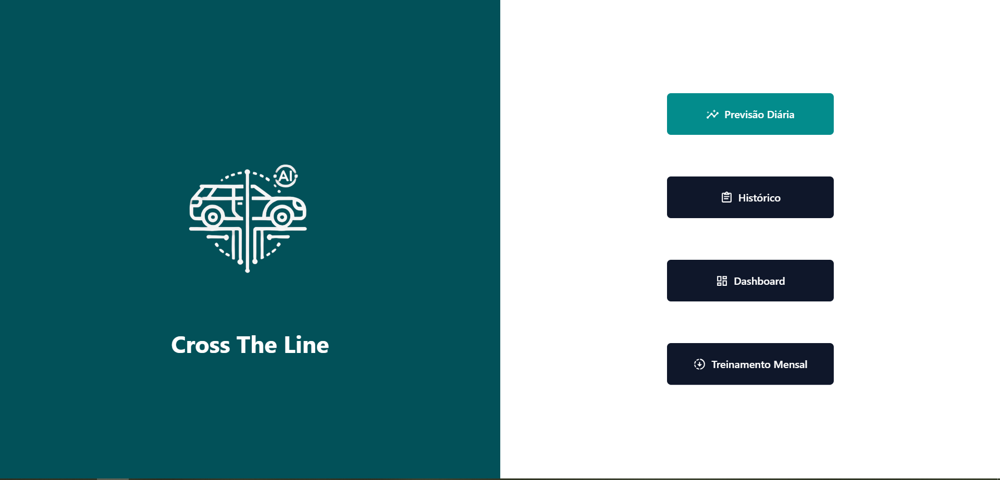
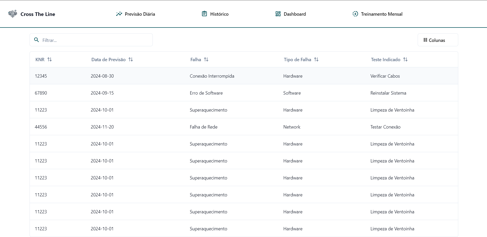
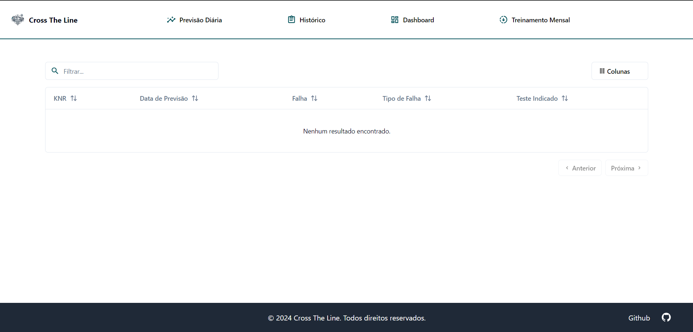
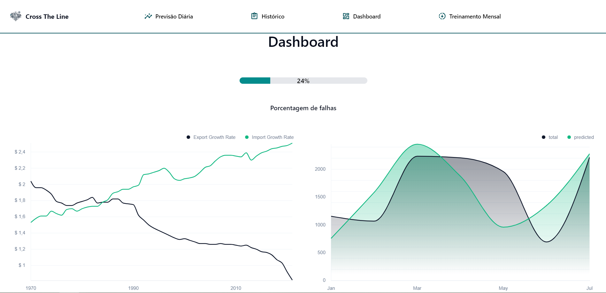

## **0.0** Introdução

O frontend deste projeto foi desenvolvido utilizando uma stack tecnológica moderna e eficiente, composta por **Nuxt.js**, **Vue.js**, **Tailwind CSS** e a biblioteca de componentes **shadcn/vue**.

O por que da escolha destas tecnologias pode ser visto na seguinte página: [Tecnologias Utilizadas](/Sprint%202/Interface).

## **1.1** Telas Principais do Frontend

A seguir, serão detalhadas as principais telas desenvolvidas no frontend, destacando suas funcionalidades e componentes utilizados.

### **1.2** Landing Page

A Landing Page é a porta de entrada do aplicativo, projetada para atrair e informar os usuários sobre as funcionalidades oferecidas.

**Funcionalidades:**

- **Apresentação do Produto**: Descrição clara e concisa dos principais recursos e benefícios.
- **Chamada para Ação (CTA)**: Botões e links que incentivam o usuário a explorar mais a fundo a aplicação.
- **Design Responsivo**: Layout adaptável para dispositivos móveis e desktops.

Utilizamos componentes de layout e tipografia da shadcn/vue, estilizados com Tailwind CSS, para criar uma interface atraente e moderna.

Segue abaixo uma imagem da Landing Page:

### **1.3** Histórico

Esta tela exibe um registro detalhado das falhas identificadas pelo sistema de inteligência artificial.

**Destaques:**

- **Listagem das Falhas**: Exibição de falhas com detalhes como data, descrição e classe.
- **Filtros e Pesquisa**: Possibilidade de filtrar falhas por data, tipo, classe ou knr, e pesquisar por palavras-chave.
- **Visualização Detalhada**: O usuário poderá ter uma visão geral sobre todas as falhas que já ocorreram

A implementação desta tela aproveita componentes de tabela e modais da shadcn/vue para uma experiência de usuário intuitiva.

Segue abaixo uma imagem do Histórico:

Parte 1,

Parte 2,

### **1.4** Dashboard com Gráficos

O dashboard fornece visualizações gráficas das falhas detectadas, tendências e outras métricas importantes.

**Recursos Incluídos:**

- **Gráficos Interativos**: Utilização de componenentes de gráfico do ShadCN para exibir dados de forma clara e compreensível.
- **Atualização em Tempo Real**: Dados atualizados dinamicamente conforme novas falhas são detectadas.
- **Personalização**: Opção para o usuário selecionar quais métricas deseja visualizar nos gráficos.

A integração dos gráficos do ShadCN com o Tailwind CSS permite criar visualizações atraentes e informativas para o usuário.

:::warning
Garantir que os gráficos sejam acessíveis, fornecendo alternativas textuais e garantindo contraste adequado de cores.
:::

Segue abaixo uma imagem do Dashboard:

### **1.5** Adicionar Arquivo para Treino

Está tela permite que o usuário faça o upload de arquivos para treinar o modelo de inteligência artificial, resultando em um modal de confirmação de envio. Mostrando o progresso do envio e um modal de confirmação de sucesso.

O modal de confirmação de sucesso exibe uma mensagem de sucesso, um botão para aceitar o novo modelo e um botão para reverter ao modelo antigo.

Segue abaixo uma imagem da tela de adicionar arquivo para treino:

Segue abaixo uma imagem do modal de confirmação de envio:

### **1.6** Tela de Previsão de KNR

Esta tela permite que o usuário insira um KNR (Número de Registro de Veículo) e visualize as previsões de falhas associadas ao carro, indicando se há ou não uma falha prevista para aquele veículo. O resultado exibe um gráfico categorizando os tipos de falhas potenciais e seus status.

#### Campo de Busca  

O usuário digita o número de KNR desejado para realizar a busca das falhas previstas.  
- **Funcionalidade**: Após inserir o KNR e clicar no ícone de lupa, a tela busca o status do veículo relacionado ao KNR.

#### Indicação de Falha ou Não Falha  

Após a busca, a tela exibe uma indicação visual sobre a condição do veículo:
- **Carro sem falha prevista**: Caso um KNR válido seja inserido e o veículo não tenha falhas previstas, o usuário será redirecionado para a tela "Sem Falha Indicada".
- **Carro com falha prevista**: Se o KNR possuir uma falha associada, o usuário será redirecionado para a tela "Teste de Rodagem Indicado", que exibe os detalhes da falha.

**Modal de Previsão dos KNRs (sem Erros)**

**Modal de Previsão dos KNRs (com Erros)**

#### Mensagens de Erro 

Caso o KNR inserido seja inválido ou não retorne dados, a tela deverá exibir uma mensagem de erro ou de ausência de informações, solicitando um novo input.

## **2.1** Considerações Finais

Neste projeto, desenvolvemos uma aplicação frontend completa utilizando Nuxt.js, Vue.js, Tailwind CSS e shadcn/vue, resultando em uma plataforma moderna, performática e centrada no usuário. As principais telas e funcionalidades implementadas foram:

- **Landing Page:** Servindo como a porta de entrada do aplicativo, projetada para apresentar o produto de forma clara e atraente. Com chamadas para ação estratégicas e um design responsivo, incentivamos os usuários a explorarem mais profundamente a aplicação.

- **Histórico:** Uma tela dedicada que exibe um registro detalhado das falhas identificadas pelo sistema de inteligência artificial. Implementamos funcionalidades de listagem, filtros avançados e pesquisa por palavras-chave, permitindo que os usuários visualizem e analisem as falhas de maneira eficiente.

- **Dashboard com Gráficos:** Fornece visualizações gráficas interativas das falhas detectadas, tendências e outras métricas importantes. Com atualização em tempo real e opções de personalização, os usuários podem monitorar o desempenho e identificar padrões relevantes.

- **Tela de Previsão de KNR:** Permite que o usuário insira um KNR (Número de Registro de Veículo) e visualize as previsões de falhas associadas ao veículo. A interface oferece feedback visual claro sobre a condição do veículo e inclui mensagens de erro amigáveis em caso de inputs inválidos.

:::info 
Continuar investindo em testes automatizados e monitoramento para manter a qualidade e confiabilidade da aplicação ao longo do tempo.
:::