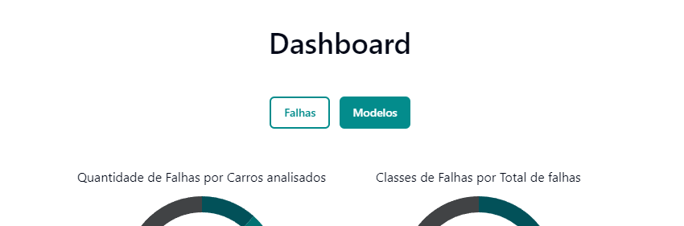
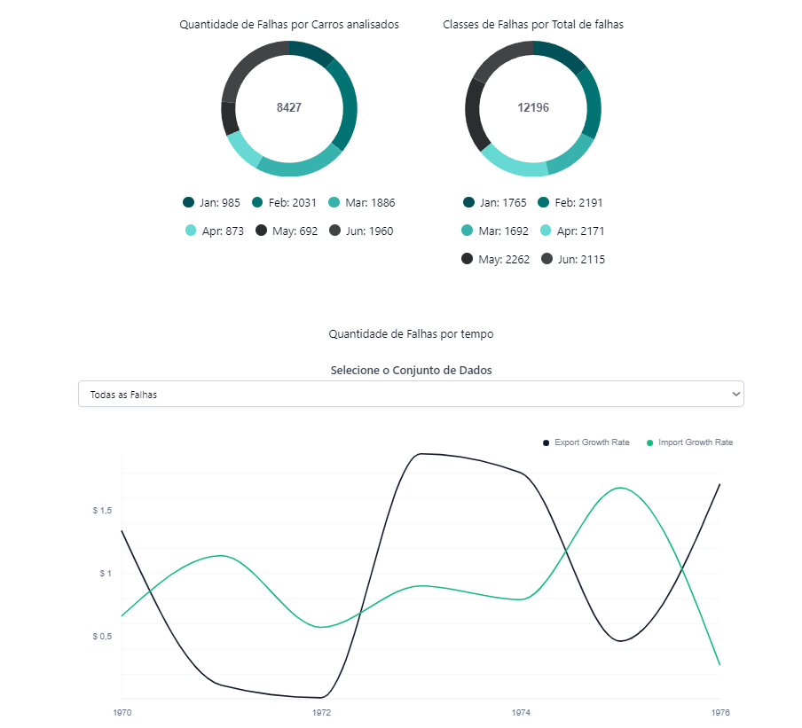
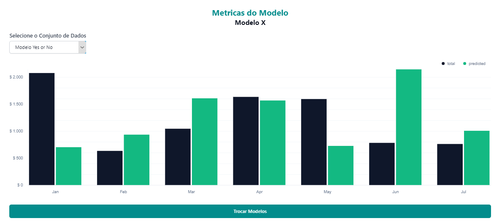

---

title: "Visualização de Dados"  
sidebar_position: 4

---

# Visualização de Dados

## Introdução

A visualização de dados é uma ferramenta essencial para análise e interpretação de informações complexas, principalmente no contexto de projetos de manufatura e predição. Neste projeto, a visualização de dados está dividida em duas partes principais: análise de falhas na fabricação de automóveis e avaliação de métricas dos modelos preditivos desenvolvidos. Esses gráficos interativos facilitam a identificação de padrões de falhas e a avaliação do desempenho dos modelos, auxiliando na tomada de decisões rápidas e informadas.

Para promover uma experiência de usuário intuitiva, as visualizações estão organizadas na aba "Dashboards". Nela, botões de navegação permitem fácil transição entre diferentes telas de análise, como ilustrado abaixo:

### Estrutura da Visualização

A seguir, exploramos as duas seções principais de visualização: **Falhas** e **Modelo**, incluindo os endpoints que fornecem dados para esses gráficos e como funcionam as visualizações.

## Falhas

A seção **Falhas** tem como objetivo oferecer uma visão detalhada dos problemas encontrados durante o processo de fabricação de automóveis. Ela auxilia na identificação de tendências e facilita a proposição de melhorias, destacando falhas recorrentes e permitindo um entendimento completo da qualidade da produção. Três gráficos compõem esta análise:

- **Gráfico de Pizza (Proporção de Carros com Falhas):** Mostra a proporção de veículos com falhas, facilitando uma análise rápida do percentual de carros defeituosos em relação ao total inspecionado. Os dados são buscados pelo endpoint `GET /api/failures/proportion`, que retorna um objeto JSON com a contagem de veículos com e sem falhas. A visualização usa esses dados para gerar um gráfico de pizza de fácil compreensão.

- **Gráfico de Pizza (Distribuição dos Tipos de Falhas):** Este gráfico destaca os diferentes tipos de falhas, indicando quais são as mais frequentes. O endpoint `GET /api/failures/types-distribution` retorna um objeto JSON contendo a contagem de cada tipo de falha encontrada. A visualização transforma esses dados em uma segunda pizza, exibindo claramente quais tipos de falhas são mais comuns e auxiliando na priorização de correções.

- **Gráfico de Linha Temporal (Evolução das Falhas):** A evolução do número de falhas ao longo do tempo é apresentada neste gráfico. O usuário pode selecionar categorias específicas de falhas via dropdown, possibilitando uma análise segmentada. O gráfico obtém seus dados através do endpoint `GET /api/failures/timeline?fail_code=<categoria>`, onde `<categoria>` é o tipo de falha selecionado pelo usuário. Este endpoint retorna um histórico mensal da quantidade de falhas da categoria escolhida, permitindo identificar padrões temporais ou anomalias.

Esses gráficos fornecem uma visão abrangente das falhas, tanto em termos de quantidades totais quanto em tendências temporais e classificação de tipos.

## Modelo

A seção **Modelo** é destinada à avaliação de desempenho dos modelos preditivos. Com o auxílio de um gráfico de barras interativo, diferentes métricas são comparadas para medir a eficácia dos algoritmos em prever resultados e identificar padrões.

- **Gráfico de Barras (Avaliação de Desempenho dos Modelos de Predição):** O gráfico de barras exibe uma comparação clara das métricas de desempenho para cada modelo. Os dados são fornecidos pelo endpoint `GET /api/models/current-models`, que retorna um array de objetos JSON, onde cada objeto contém métricas de avaliação como `accuracy`, `precision`, `recall` e `f1_score` para diferentes modelos. O usuário pode selecionar qualquer um dos 10 modelos disponíveis para exibir suas métricas, com uma barra adicional de cor mais escura que atua como meta definida pelo usuário para comparação. Isso permite verificar se os modelos estão atendendo aos objetivos estabelecidos e facilita a identificação de áreas que necessitam de melhorias.

A visualização detalhada dos modelos auxilia na escolha do modelo que melhor atende às necessidades do projeto e orienta ajustes baseados em dados concretos.

## Funcionamento dos Gráficos

### Atualização dos Dados

Os gráficos são atualizados dinamicamente a partir dos endpoints descritos. Quando o usuário navega pelas abas ou interage com os dropdowns para escolher modelos ou tipos de falhas, são feitas requisições assíncronas aos endpoints usando `fetch` ou `axios`. Os dados retornados são então processados e formatados para se adequar à estrutura esperada pelos componentes de gráficos.

### Estrutura dos Dados

- **Gráficos de Pizza (Falhas):** Os dados são apresentados em um formato de contagem (`count`) para cada categoria (ex.: veículos com falhas, tipos de falhas). Esses dados são transformados em proporções, permitindo que os gráficos exibam a distribuição correta.

- **Gráfico de Linha Temporal (Evolução de Falhas):** Os dados retornam como contagem por mês para diferentes tipos de falhas. A interface transforma esses dados em pontos ao longo do tempo, permitindo que o gráfico de linha mostre uma evolução mensal ou anual.

- **Gráfico de Barras (Métricas de Modelos):** Os dados retornam como métricas (`accuracy`, `precision`, `recall`, `f1_score`) para até 10 modelos. O gráfico é construído para comparar essas métricas lado a lado, destacando as metas definidas pelo usuário.

## Conclusão

A abordagem de visualização de dados adotada neste projeto simplifica a análise de informações complexas relacionadas a falhas de fabricação e avaliação de modelos preditivos. A organização em gráficos intuitivos e interativos capacita os usuários a identificar tendências, avaliar a eficácia dos modelos e tomar decisões estratégicas com precisão. A aba "Dashboards" funciona como um ponto central de navegação, proporcionando uma experiência fluida e eficiente.

Essa abordagem clara e detalhada apoia a melhoria contínua dos processos de manufatura e a evolução dos modelos de predição, fortalecendo a comunicação dos resultados e a tomada de decisão baseada em dados sólidos.
